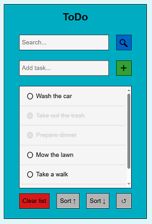
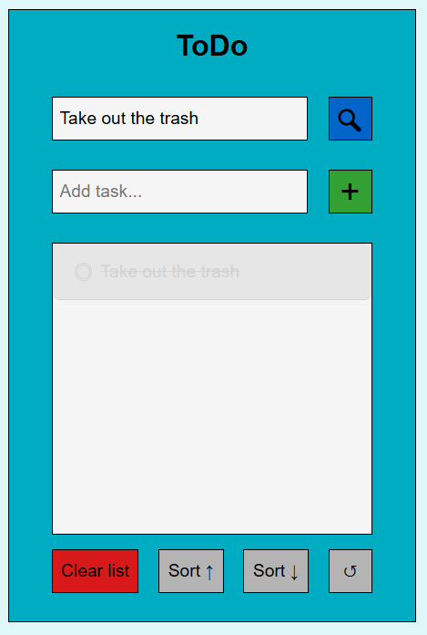

# A simple todo-app

## It uses the browser local storage to save the tasks and their status between browser sessions.

### Input fields:

"Search..." - Searches among the entered tasks. It is specific and case sensitive. Press the magnifying glass-button to search.
"Add task..." - Enter what you want to add to the list. Press enter or the plus sign-button to add the task.

### List:

List - An unirdered list that, will be scrollable if there are more items than fits within the height.
List items - Click the list items to toggle their status. Longer text will wrap.

### Bottom buttons:

"Clear list" - Clears the local array, list and local storage. You will be prompted to confirm the deletion.
Sort buttons - Allows you to sort the items in an ascending or descending order. It does not mutate the original array.
"Reset/Reload" - Unsort the list if it is sorted, the entries will appear in the order they were entered.

### Special features:

Empty input warning - If you try to add an empty task the input field will flash red and the task will not be added to the list.
Duplicate warning - If you try to add a task that is already in the list the input field will flash yellow and the task will not be added to the list. It is not case sensitive.

---

